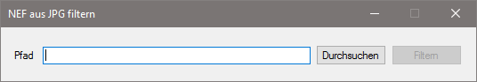

# NEF aus JPG's filtern

  

##Inhalt
Hier finden Sie den Sourcecode für das Programm.

##Zweck
Wenn man als Fotograf mit RAW und JPG Bilder arbeitet, dann verwendet man oft die JPG's als Vorschau am PC, um schnell die Bilder aussortieren zu können, die man behalten möchte, was mit RAW nicht möglich ist, da sie deutlich größer sind.

Da man nun aber nur noch die RAW Bilder braucht, zu denen es auch JPG's gibt, wäre es ganz nützlich, wenn das nun benötigte monotone Aussortieren ein Programm übernehmen würde. Und genau dazu ist dieses Programm.

Es löscht automatisch alle NEF Bilder, zu denen kein JPG Bild mit dem gleichen Namen gefunden werden kann.